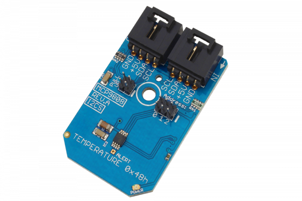

[](https://store.ncd.io/product/mcp9808-maximum-accuracy-digital-temperature-sensor-%C2%B10-25-from-40c-to-125c-i2c-mini-module/).

#  MCP9808

The MCP9808 is perhaps one of the most accurate temperature sensors we have seen.This device offers an incredible ±0.25 of accuracy over an extended temperature range of -40°C to +125°C.
This Device is available from www.ncd.io 

[SKU: MCP9808]

(https://store.ncd.io/product/mcp9808-maximum-accuracy-digital-temperature-sensor-%C2%B10-25-from-40c-to-125c-i2c-mini-module/)
This Sample code can be used with Raspberry Pi.

Hardware needed to interface MCP9808 temperature sensor With Raspberry Pi :
1. <a href="https://store.ncd.io/product/mcp9808-maximum-accuracy-digital-temperature-sensor-%C2%B10-25-from-40c-to-125c-i2c-mini-module/">MCP9808 temperature sensor</a>
2.  <a href="https://store.ncd.io/product/i2c-shield-for-raspberry-pi-3-pi2-with-outward-facing-i2c-port-terminates-over-hdmi-port/">Raspberry Pi I2C Shield</a>
3. <a href="https://store.ncd.io/product/i%C2%B2c-cable/">I2C Cable</a>

## Python
Download and install smbus library on Raspberry pi. Steps to install smbus are provided at:

https://pypi.python.org/pypi/smbus-cffi/0.5.1

Download (or git pull) the code in pi. Run the program.

```cpp
$> python MCP9808.py
```
The lib is a sample library, you will need to calibrate the sensor according to your application requirement.
